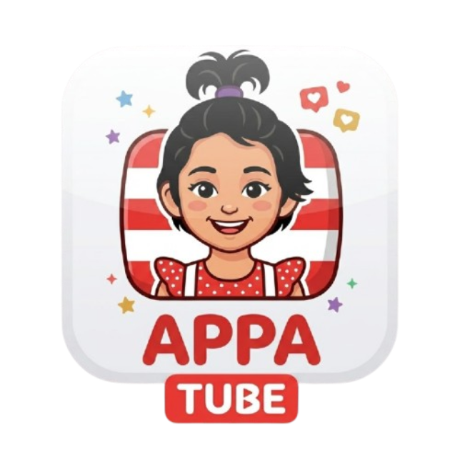
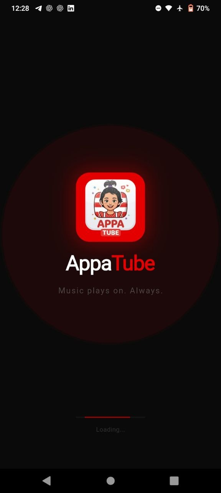
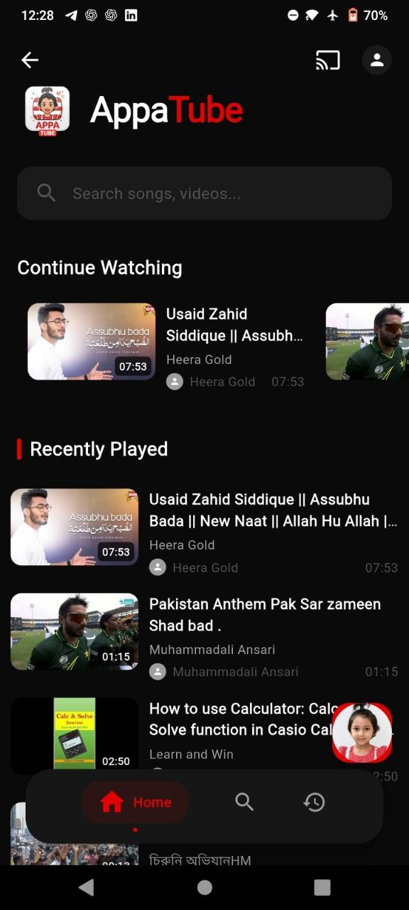
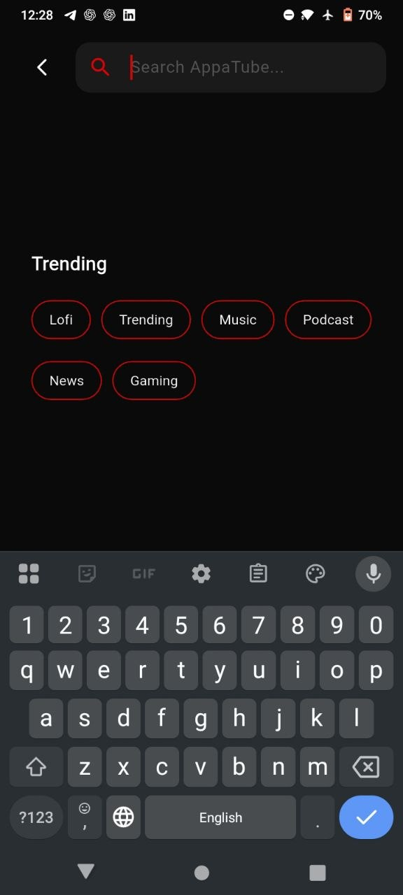
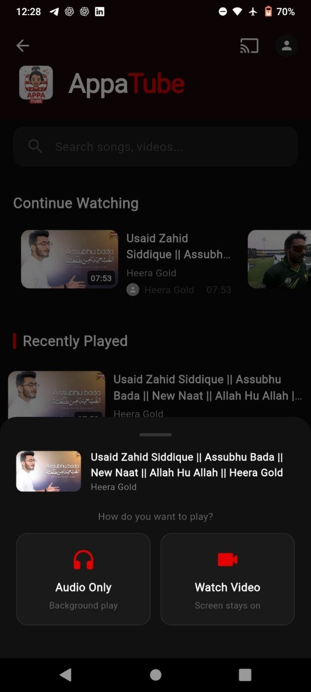
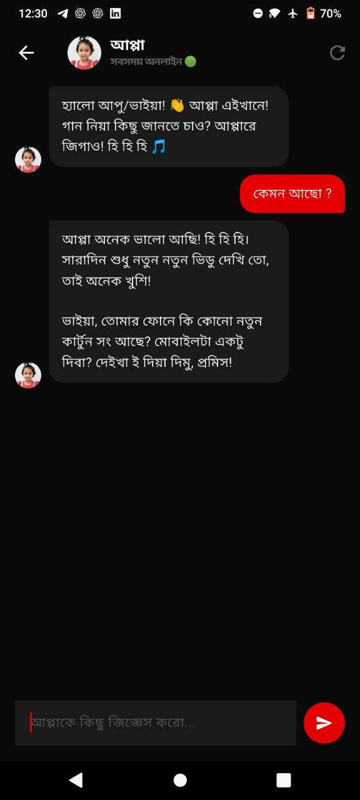
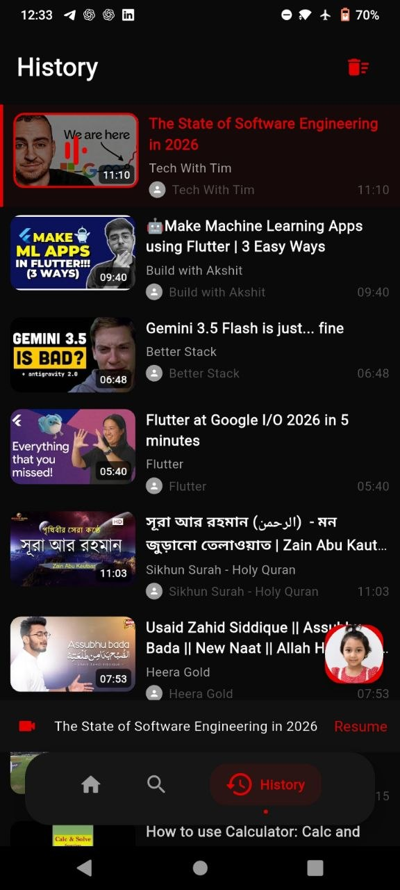

# AppaTube 📺

<p align="center">
  
</p>

AppaTube is a high-performance, feature-rich YouTube client built with Flutter. It focuses on providing a seamless streaming experience with background playback capabilities, AI-powered content insights, a modern Material 3 interface, and local data persistence.


## ✨ Features

- 🔍 **Global Search**: Find any video or music on YouTube with ease.
- 🤖 **AI Insights**:
    - 📝 **Smart Summaries**: Get 30s, 2min, or detailed summaries of any video.
    - 💡 **Key Points & Action Items**: Extract important takeaways and tips automatically.
    - 📍 **Smart Timestamps**: AI-generated chapter markers for quick navigation.
    - 🎓 **Learning Mode**: Transform videos into structured notes, flashcards, and revision points.
    - 💬 **Video Chat**: Ask questions directly about the video content.
- 🎧 **Background Playback**: Keep listening to your favorite content even when the app is minimized or the screen is off.
- 📱 **Miniplayer**: Continue watching while navigating through other parts of the app.
- 🕒 **History Tracking**: Automatically save your playback history locally.
- 🎨 **Material 3 Design**: A beautiful, premium dark theme optimized for OLED screens.
- ⚡ **Offline First**: Fast loading with cached thumbnails and local metadata storage.

## 📸 Screenshots

| | | | |
|:---:|:---:|:---:|:---:|
|  |  |  |  |
|  |  |  |  |  |

## 🚀 Tech Stack

- **Framework**: [Flutter](https://flutter.dev/)
- **AI Engine**: [Google Generative AI (Gemini)](https://ai.google.dev/)
- **State Management**: [Riverpod](https://riverpod.dev/) with Code Generation
- **Audio Engine**: [just_audio](https://pub.dev/packages/just_audio) & [audio_service](https://pub.dev/packages/audio_service)
- **YouTube API**: [youtube_explode_dart](https://pub.dev/packages/youtube_explode_dart)
- **Local Database**: [Hive](https://docs.hivedb.dev/)
- **Networking**: [Dio](https://pub.dev/packages/dio)
- **Environment Config**: [flutter_dotenv](https://pub.dev/packages/flutter_dotenv)

## 📦 Installation

1. **Clone the repository:**
   ```bash
   git clone https://github.com/mdkhanbahadursadi/AppaTube.git
   cd AppaTube
   ```

2. **Setup Environment Variables:**
   Create a `.env` file in the root directory and add your Gemini API Key:
   ```env
   GEMINI_API_KEY=your_api_key_here
   ```

3. **Install dependencies:**
   ```bash
   flutter pub get
   ```

4. **Generate required files:**
   Since the project uses code generation for Riverpod and Hive:
   ```bash
   flutter pub run build_runner build --delete-conflicting-outputs
   ```

5. **Run the app:**
   ```bash
   flutter run
   ```

## 🛠️ Configuration

### Gemini AI Setup
To use the AI Insight features, you need a Google Gemini API Key. You can get one for free from the [Google AI Studio](https://aistudio.google.com/).

### Android Cleartext Traffic
The app uses a local proxy for `just_audio`. Ensure the following is set in your `AndroidManifest.xml` (already configured in this repo):
- `android:networkSecurityConfig="@xml/network_security_config"`

## 📂 Project Structure

```text
lib/
├── app/                # App-wide configurations and routing
├── core/               # Constants, services (AI, Youtube, etc.), and utilities
├── data/               # Data models and repositories
├── presentation/       # UI screens, widgets, and providers
│   ├── providers/      # Riverpod state management
│   ├── screens/        # Individual app pages (AI Insights, Search, etc.)
│   └── widgets/        # Reusable UI components
└── main.dart           # Entry point
```

## 🤝 Contributing

Contributions are welcome! Please feel free to submit a Pull Request.

1. Fork the Project
2. Create your Feature Branch (`git checkout -b feature/AmazingFeature`)
3. Commit your Changes (`git commit -m 'Add some AmazingFeature'`)
4. Push to the Branch (`git push origin feature/AmazingFeature`)
5. Open a Pull Request

## 📄 License

This project is licensed under the MIT License - see the [LICENSE](LICENSE) file for details.

---
Developed with ❤️ by [Md Khan Bahadur Sadi]
